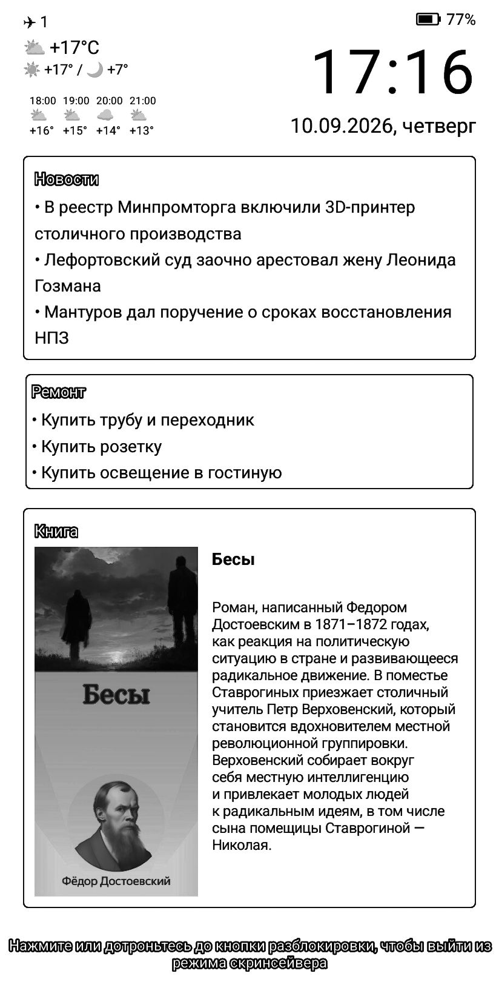
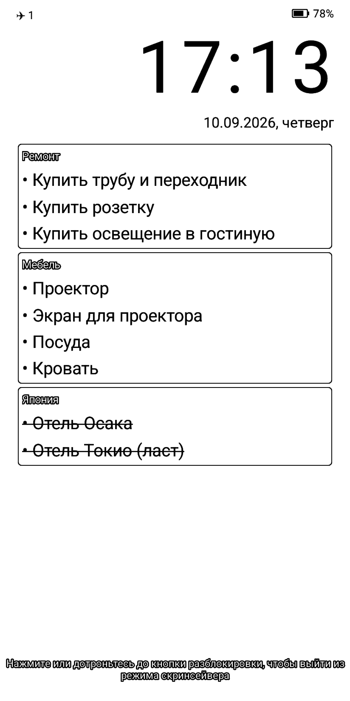
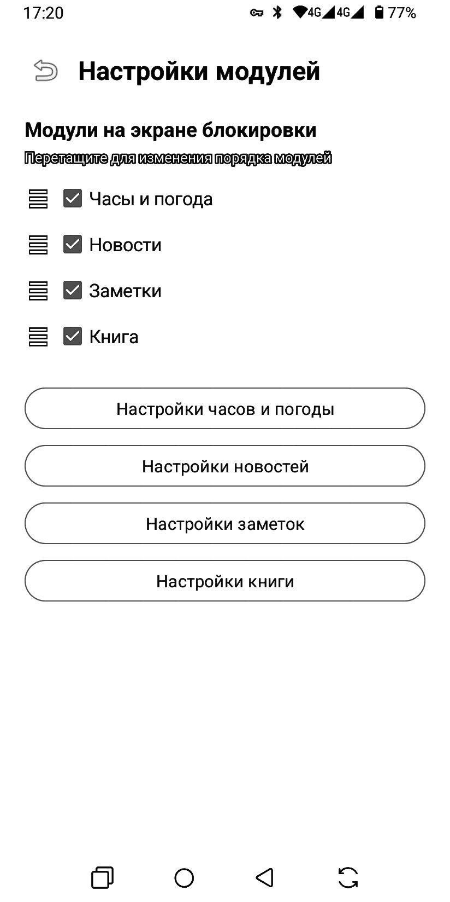
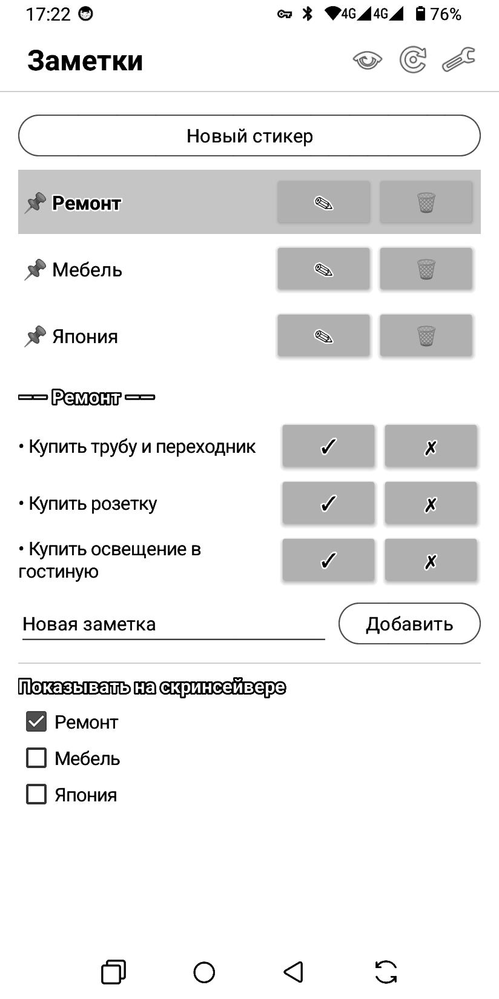
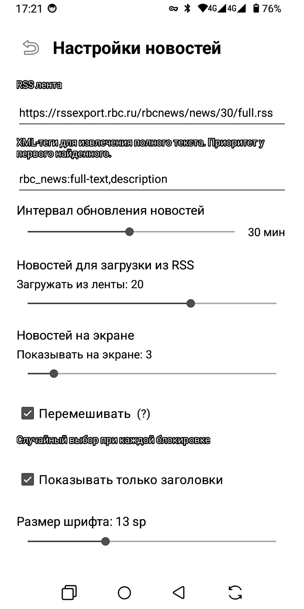

# E-Ink Screensaver

| Экран блокировки | Только заметки | Порядок блоков | Редактор заметок | Настройки модуля |
|---|---|---|---|---|
|  |  |  |  |  |

Дефолтный скринсейвер на устройствах Bigme не очень информативен, поэтому
родилась идея переписать его под ведение заметок и показ дополнительных
информационных полей. Всё это всегда перед вашими глазами на e-ink дисплее, и
не надо нажимать никакие кнопки, чтобы это увидеть.

Основной функционал приложения:

- **заметки** — стикеры со списками дел и покупок, выполненное отмечается,
  ненужный стикер прячется;
- **часы и дата**;
- **погода** — сейчас, день/ночь и почасовой прогноз;
- **новости** из любой RSS-ленты;
- **книга**, которую вы сейчас читаете, с обложкой и аннотацией;
- **заряд батареи** в правом верхнем углу;
- **пропущенные SMS, сообщения Telegram и звонки** — в левом верхнем.

Любое поле можно выключить, любое — переставить: экран собирается из блоков в
том порядке, который вы зададите.

Проверено только на **Bigme HiBreak Pro** (Android 14), прошивка 3.1.6. На
других HiBreak должно работать тоже. На прочих Android-устройствах приложение
работает, но без вендорных оптимизаций — см. «Что даёт прошивка Bigme».

---

> [!WARNING]
> **Приложение писалось для себя, вайб-кодингом.** Ни тестирования, ни ревью
> оно не проходило: тестов в проекте нет, проверка ручная и на одном
> устройстве.
>
> Код открыт — посмотрите, что именно вы ставите. Устанавливая приложение, вы
> соглашаетесь с тем, что баги возможны, и берёте риски на себя. Разработчик
> ответственности не несёт — ни за потерянные заметки, ни за разряженную
> батарею, ни за экран, который не разблокировался с первого раза.

## Настройка

Кнопки в правом верхнем углу главного экрана: **предпросмотр**,
**синхронизация**, **настройки**.

Главный экран — это редактор заметок. Здесь создаются стикеры, внутри них
заметки, отмечаются выполненные и выбирается, какие стикеры показывать на
экране блокировки. Всё остальное живёт в настройках.

Все настройки применяются сразу, кнопок «Сохранить» нет. Текстовые поля
(город, адрес RSS, ID пользователя) записываются при выходе с экрана.

- **Часы и погода** — интервал обновления, дата, положение часов (погода
  всегда с противоположной стороны), размеры шрифтов; там же включается
  погода, город, шаг прогноза 1–6 часов и количество иконок 0–4.
- **Новости** — адрес RSS, сколько загружать и сколько показывать,
  перемешивание, только заголовки.
- **Заметки** — количество колонок и размер шрифта. Сами стикеры и заметки
  создаются на главном экране.
- **Книга** — ID пользователя Яндекс Книг, обложка как фон.

Порядок блоков на экране блокировки меняется перетаскиванием в «Настройках
модулей».

Заряд батареи и счётчики уведомлений настроек не имеют и в порядке блоков не
участвуют: они всегда в верхних углах, счётчики появляются только когда есть
что показать.

Погода берётся из **Open-Meteo** — API-ключ не нужен, достаточно названия
города.

---

## Установка

### 1. Удалите штатный скринсейвер

Для первого пробного запуска можно не удалять, ничего страшного не случится.
Но если планируете пользоваться постоянно — удалите после того, как поставите
это приложение.

Свой скринсейвер Bigme запускается при каждом гашении экрана и будет
конфликтовать с этим приложением — два экрана блокировки полезут поверх друг
друга. Удалите дефолтный скринсейвер через настройки.

Удаление не навсегда — приложение системное, и **после перезагрузки телефона
оно вернётся само**, удалять придётся снова.

### 2. Поставьте APK

Скопируйте `app-debug.apk` на устройство и откройте его. Android спросит
разрешение на установку из этого источника — разрешите.

### 3. Разрешите ограниченные настройки

**Это самый важный шаг, и его легко пропустить.** Android 13 и новее
блокирует спец. возможности для приложений, установленных не из магазина.
Пока это не снято, переключатель в спец. возможностях будет молча
возвращаться в выключенное положение, и причина ниоткуда не видна.

1. Настройки → Приложения → **E-Ink Screensaver**
2. Меню (три точки в углу) → **«Разрешить ограниченные настройки»**

### 4. Включите «Возврат в сон»

Настройки → Спец. возможности → **E-Ink Screensaver: возврат в сон** → включить.

Без этого разрешения приложение работает, но **при каждой блокировке экрана
на мгновение вспыхивает подсветка**. Сервис не читает содержимое экрана и не
перехватывает события — он существует ради одного системного вызова, который
укладывает устройство обратно в сон после перерисовки.

### 5. Разрешите уведомления

При первом запуске приложение попросит разрешение на уведомления. Оно
обязательно: Android не даёт фоновому сервису работать без постоянного
уведомления. Пока его нет, кнопка включения скринсейвера неактивна.

### 6. Дайте доступ к уведомлениям — если нужны счётчики

Настройки → Приложения → Специальный доступ → **Доступ к уведомлениям** →
включить E-Ink Screensaver. Или кнопкой «Дать доступ к уведомлениям» в
настройках приложения.

Нужен только для значков в левом верхнем углу: пропущенные SMS, сообщения
Telegram и звонки. Приложение не читает ни заголовков, ни текстов — только
приложение-отправитель и количество сообщений. Без этого разрешения угол
просто остаётся пустым.

Здесь то же ограничение из шага 3: на Android 13 и новее переключатель не
удержится, пока не снято ограничение для установленных не из магазина.

### 7. Включите скринсейвер

Откройте приложение → шестерёнка в правом верхнем углу → **«Включить
скринсейвер»**.

---

<details>
<summary><b>Что даёт прошивка Bigme</b></summary>

<br>

Приложение использует вендорные методы и библиотеку производителя для
управления панелью и уходом в сон. Ничего из этого не документировано — всё
разобрано реверс-инжинирингом штатного скринсейвера Bigme и прошивки, и часть
найденных методов удалось задействовать. На любом другом устройстве эти вызовы
просто не находятся, и приложение работает обычным путём.

- **Частичное обновление панели.** Тик часов перерисовывает только то, что
  изменилось, без мигания чёрным и белым. Полная очистка панели делается раз
  в три часа, а также при появлении экрана блокировки и при разблокировке —
  чтобы накопленный призрак не оставался под следующим приложением.
- **Пробуждение без подсветки** — панель обновляется, подсветка не
  включается. Ради этого и нужен «Возврат в сон»: состояние, в котором
  панель не зажигается, нужно корректно покинуть, иначе экран останется
  неотзывчивым.
- Ограничение Android на такие вызовы снимается библиотекой
  **HiddenApiBypass**. Ни root, ни установленный LSPosed не требуются.

</details>

<details>
<summary><b>Если что-то пошло не так</b></summary>

<br>

**Скринсейвер не появляется при блокировке.** Проверьте, что он включён в
настройках приложения и что выдано разрешение на уведомления.

**После переустановки приложения экран блокировки перестал появляться:
подсветка гаснет, и больше ничего.** Android убивает сервис спец. возможностей
при переустановке и помечает его как аварийный, но в списке включённых он при
этом остаётся — выглядит как включённый, а на деле не работает. Без него
приложение не может ни зажечь экран, ни поднять свою активити из фона.
Лечится выключением и включением «Возврата в сон» в спец. возможностях
(шаг 4). Делайте это после каждой переустановки.

**Пропали счётчики уведомлений после переустановки.** То же самое —
переключите доступ к уведомлениям из шага 6.

**Подсветка вспыхивает при блокировке.** Не включён «Возврат в сон» —
вернитесь к шагам 3 и 4.

**Переключатель в спец. возможностях сам выключается.** Не снято
ограничение из шага 3.

**Экран не отвечает на касания после блокировки.** Приложение защищено от
этого автоматом отключения, но если такое случилось — заблокируйте и
разблокируйте устройство кнопкой питания. Состояние сбрасывается при
следующем нормальном пробуждении.

**Погода пустая.** Проверьте название города латиницей (например `Kazan`) и
нажмите кнопку синхронизации на главном экране.

</details>

<details>
<summary><b>Сборка из исходников</b></summary>

<br>

Нужен **JDK 21** — `JAVA_HOME` может указывать на JDK 25, который AGP 8.9 не
поддерживает:

```bash
JAVA_HOME="$HOME/.jdks/jbr-21.0.11" ./gradlew assembleDebug
```

APK окажется в `app/build/outputs/apk/debug/`.

</details>
